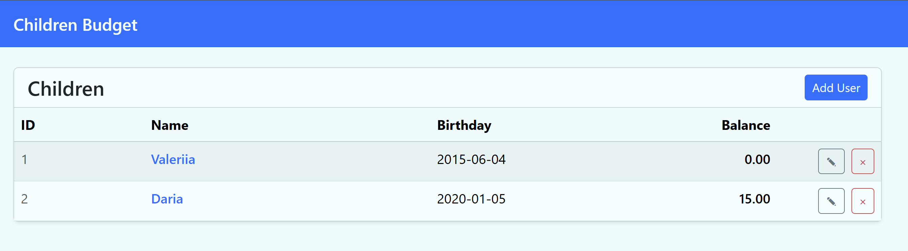
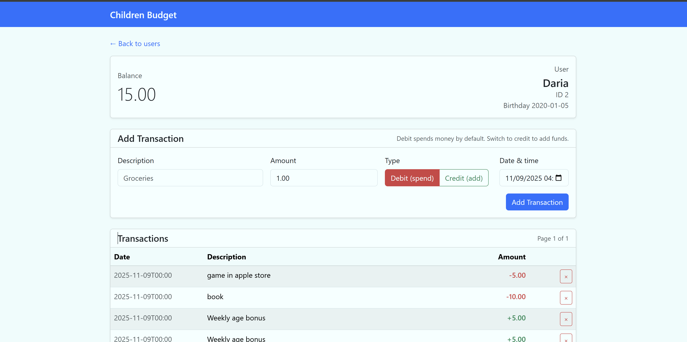
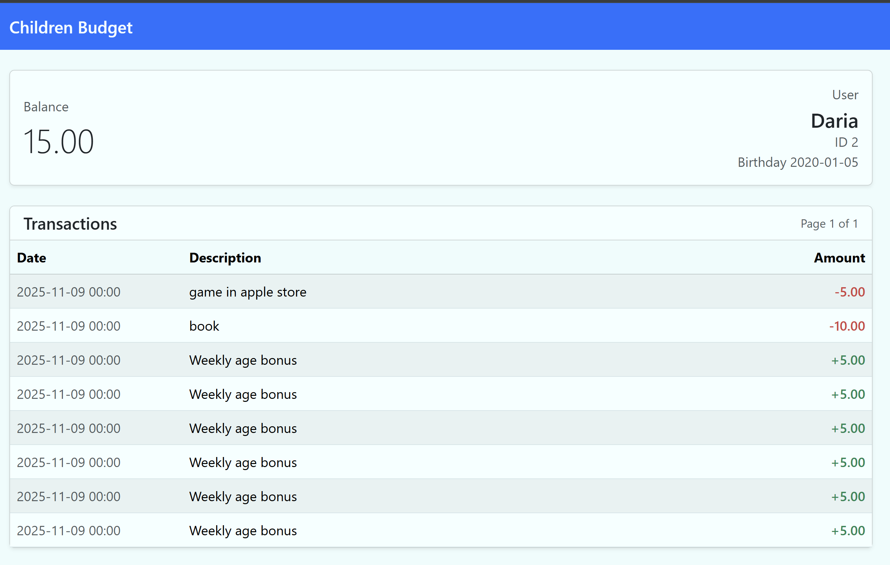
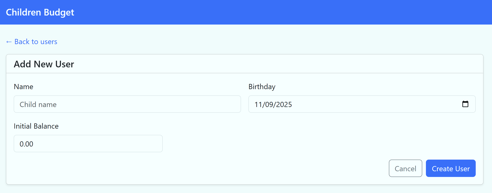
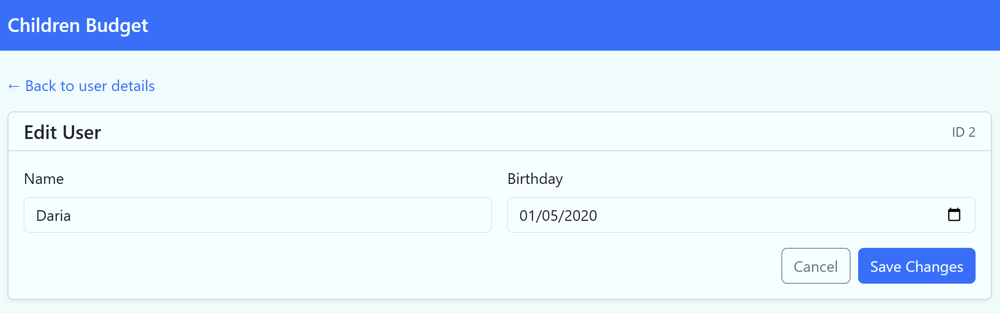

# Children Budget

Helps families track kids' balances, allowances, and transactions.

> **Heads up:** this project is vibe-coded for fun. Expect quirks, shortcuts, and rough edges rather than production-grade polish.

## Docker Image

The latest container is published at [dshvechikov/children-budget](https://hub.docker.com/repository/docker/dshvechikov/children-budget).

## UI Examples

| Screen                     | Preview                                           |
|----------------------------|---------------------------------------------------|
| User list                  |       |
| User profile               |         |
| User dashboard (read-only) |  |
| Create user                |   |
| Edit user                  |       |

## Features

- Parents can manage balances and transactions for each child via authenticated `/users/{id}` pages.
- Children can view their balances and transaction histories through public read-only `/dashboard/{id}` pages.
- Basic authentication protects all management endpoints, while dashboards stay public.
- A Quartz-powered cron job credits each child with the same configurable bonus amount on a schedule you control, keeping allowances fresh automatically.

## Self-Hosting

1. Copy `docker/.env.example` to `docker/.env` and set the desired database credentials plus `APP_BASIC_AUTH_*` values.
2. Pull the latest published image and start the full stack (app + Postgres):
   ```bash
   docker compose -f docker/docker-compose.yml --env-file docker/.env up -d
   ```
3. The application will be available on `http://localhost:8080` (public dashboard) and protected endpoints can be accessed using the credentials from `.env`.

### Weekly Bonus Job Configuration

The recurring bonus job draws its settings from the `app.weekly-bonus` configuration block. The defaults (see `src/main/resources/application.yml`) look like this:

```yaml
app:
  weekly-bonus:
    amount: 5        # decimal value credited to every child
    cron: 0 0 0 ? * MON  # Quartz cron syntax
```

- `amount` must be a positive decimal value and controls how much money each child receives.
- `cron` is expressed using Quartz cron syntax (seconds minutes hours day-of-month month day-of-week year) so you can decide exactly when the job runs.

Override these values via profile-specific property files or environment variables (e.g., `APP_WEEKLY_BONUS_AMOUNT=10`).

## Technology Stack

- Java 25
- Spring Boot 3
- Spring Data JDBC
- Spring Security
- Quartz Scheduler
- Freemarker Templates

## Getting Started

1. Set up environment variables:
   - `APP_BASIC_AUTH_USERNAME`
   - `APP_BASIC_AUTH_PASSWORD`
2. Run database migrations and start the application:
   ```bash
   ./mvnw clean spring-boot:run
   ```
3. Access endpoints via Basic Auth or use the `/dashboard/{userId}` route for read-only views.

### Docker Compose

- `docker/docker-compose.dev.yml` – spins up only the Postgres database for local development.
- `docker/docker-compose.yml` – runs the published Docker image (`dshvechikov/children-budget:latest`) plus Postgres. Copy `docker/.env.example` to `docker/.env` and adjust credentials before running `docker compose -f docker/docker-compose.yml --env-file docker/.env up -d`.

## CI/CD

GitHub Actions (`.github/workflows/ci.yml`) runs automatically for every pull request and push to `main`:

- `build` job checks out the code, installs Temurin JDK 25, and runs `./mvnw clean verify`.
- `release` job (pushes to `main`) uses [semantic-release](https://github.com/semantic-release/semantic-release) to analyze commit messages, publish GitHub releases, and output the next semantic version.
- `docker` job runs after a successful semantic release, building the provided `Dockerfile` and publishing it to Docker Hub tagged with the freshly minted semantic version plus `latest`.

To enable Docker publishing, configure repository secrets:

- `DOCKERHUB_USERNAME` – Docker Hub account that will own the image.
- `DOCKERHUB_TOKEN` – Personal access token or password for that account.
